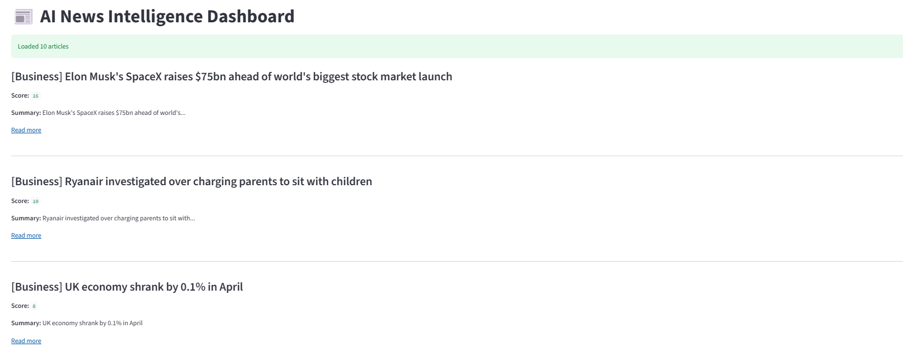

# 📰 Automated News Intelligence Pipeline

An end-to-end Python-based news aggregation and processing pipeline that fetches real-time news from RSS feeds, classifies articles, ranks them based on relevance, and generates a structured newsletter output.

---

## 🚀 Project Overview

This project simulates a real-world **news intelligence system** inspired by platforms like **Google News** and **Flipboard**.

It builds an end-to-end data pipeline that:

- Ingests live RSS feeds
- Processes and classifies articles
- Applies relevance scoring
- Generates structured newsletters
- Displays insights via Streamlit dashboard

📌 Focus: Data Engineering + NLP + Ranking Systems + Visualization

---

## 🏗️ Architecture

```
RSS Feeds
   ↓
Data Ingestion (feedparser)
   ↓
Processing Layer
   ├── Classification
   ├── Summarization
   ↓
Ranking Engine
   ↓
Newsletter Generator
   ↓
Final Output (Console + TXT file)
```

---

## ✨ Features

* 📡 RSS Feed ingestion from multiple sources
* 🧠 Rule-based article classification (Tech / Business / General)
* ✂️ Lightweight text summarization
* 📊 Custom ranking system for relevance scoring
* 🧾 Automated newsletter generation
* 🧩 Modular and scalable Python codebase

---

## 📁 Project Structure

```
.
├── config.py
├── ingest.py
├── processor.py
├── ranking.py
├── pipeline.py
├── newsletter.py
├── main.py
├── app.py
└── newsletter.txt
```

---

## ⚙️ How It Works


1. RSS feeds are fetched using `feedparser`
2. Articles are extracted (title + link)
3. Articles are classified by category
4. Headlines are summarized (extractive method)
5. Relevance score is calculated using:
   - Category weight
   - Keyword matching
6. Articles are sorted by score
7. Output generated in:
   - CLI newsletter
   - Text file
   - Streamlit dashboard

---

## ▶️ How to Run

### 1. Clone the repository

```bash
git clone https://github.com/your-username/news-pipeline.git
cd news-pipeline
```

### 2. Install dependencies

```bash
pip install feedparser
```

### 3. Run the project

```bash
python main.py
```
### 4. Run Streamlit dashboard
```bash
streamlit run app.py
```
---

## 📸 Dashboard Preview


---

## 🧠 Key Learnings

* Building modular Python applications
* Designing ETL-style data pipelines
* Working with real-time RSS data
* Rule-based NLP techniques
* Ranking and scoring systems
* Structuring production-style Python projects

---

## 🔮 Future Improvements

*Replace rule-based classification with transformer models (BERT / LLMs)
*Add semantic similarity using embeddings (Sentence-BERT)
*Improve ranking using learning-to-rank models
*Add personalization based on user behavior
*Deploy using Streamlit Cloud / AWS
*Automate newsletter delivery via email scheduling

---
## 🚀 Key Highlights

-End-to-end data pipeline system
-Modular production-style architecture
-Ranking system simulating real-world news relevance scoring
-Interactive Streamlit dashboard
-Clear ML/AI upgrade path

---
## ⚠️ Disclaimer

This project uses publicly available RSS feeds for educational purposes only.
All article titles and links belong to their respective publishers.

---

## 👨‍💻 Author
Kamal Batcha

---
