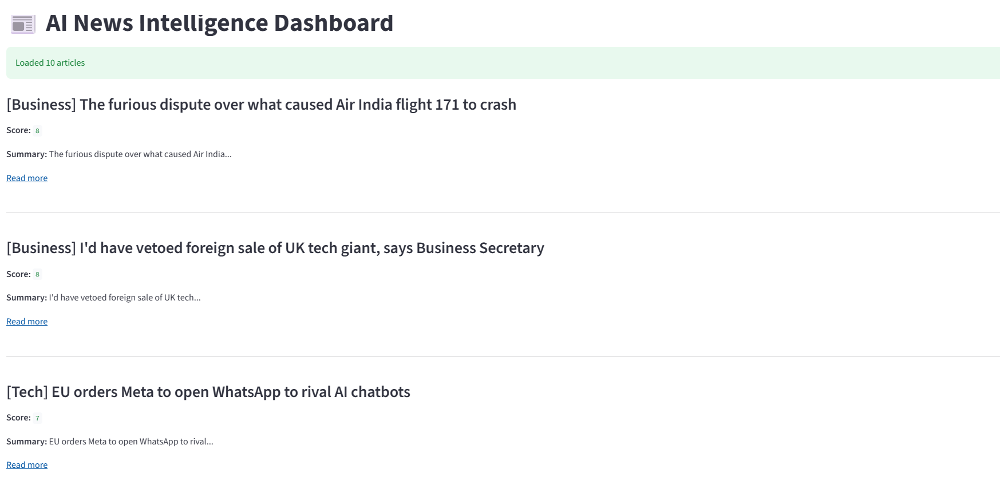

# 📰 Automated News Intelligence Pipeline (Python)

An end-to-end Python-based news aggregation and processing pipeline that fetches real-time news from RSS feeds, classifies articles, ranks them based on relevance, and generates a structured newsletter output.

---

## 🚀 Project Overview

This project demonstrates a complete data pipeline that simulates a real-world content intelligence system used in news aggregators.

It ingests live RSS feeds, processes article data, applies rule-based classification, assigns relevance scores, and generates a clean, readable newsletter.

---

## 🏗️ Architecture

```
RSS Feeds
   ↓
Data Ingestion (feedparser)
   ↓
Processing Layer
   ├── Classification
   ├── Summarization
   ↓
Ranking Engine
   ↓
Newsletter Generator
   ↓
Final Output (Console + TXT file)
```

---

## ✨ Features

* 📡 RSS Feed ingestion from multiple sources
* 🧠 Rule-based article classification (Tech / Business / General)
* ✂️ Lightweight text summarization
* 📊 Custom ranking system for relevance scoring
* 🧾 Automated newsletter generation
* 🧩 Modular and scalable Python codebase

---

## 📁 Project Structure

```
.
├── config.py         # RSS feed configuration
├── ingest.py         # Data ingestion from RSS feeds
├── processor.py      # Classification and summarization logic
├── ranking.py        # Scoring and ranking system
├── pipeline.py       # End-to-end pipeline orchestration
├── newsletter.py     # Output generation (console + file)
├── main.py           # Entry point
└── newsletter.txt    # Generated output file
```

---

## ⚙️ How It Works

1. RSS feeds are fetched using `feedparser`
2. Each article is extracted (title + link)
3. Articles are classified based on source/category rules
4. A short summary is generated from the title
5. A relevance score is calculated using keywords + category
6. Articles are sorted by score
7. A structured newsletter is generated

---

## ▶️ How to Run

### 1. Clone the repository

```bash
git clone https://github.com/your-username/news-pipeline.git
cd news-pipeline
```

### 2. Install dependencies

```bash
pip install feedparser
```

### 3. Run the project

```bash
python main.py
```
### 4. Run Streamlit dashboard
```bash
streamlit run app.py
```
---

## 📸 Dashboard Preview


---

## 🧠 Key Learnings

* Building modular Python applications
* Designing ETL-style data pipelines
* Working with real-time RSS data
* Rule-based NLP techniques
* Ranking and scoring systems
* Structuring production-style Python projects

---

## 🔮 Future Improvements

* Replace rule-based classification with ML models (TF-IDF / BERT)
* AI-powered summarization using LLMs
* Store articles in a database (SQLite/PostgreSQL)
* Email automation for newsletter delivery
* Web dashboard using Streamlit
* Cloud deployment (AWS Lambda / EC2)

---

## ⚠️ Disclaimer

This project uses publicly available RSS feeds for educational purposes only.
All article titles and links belong to their respective publishers.

---

## 👨‍💻 Author

Built as part of a personal portfolio to demonstrate Python, data pipelines, and automation skills.

---
